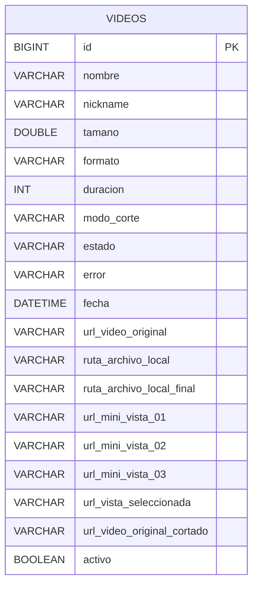

# Modelo H2 - VideoPoc

## Entidad principal

```mermaid
erDiagram
    VIDEOS {
        BIGINT id PK
        VARCHAR nombre
        VARCHAR nickname
        DOUBLE tamano
        VARCHAR formato
        INT duracion
        VARCHAR modo_corte
        VARCHAR estado
        VARCHAR error
        DATETIME fecha
        VARCHAR url_video_original
        VARCHAR ruta_archivo_local
        VARCHAR ruta_archivo_local_final
        VARCHAR url_mini_vista_01
        VARCHAR url_mini_vista_02
        VARCHAR url_mini_vista_03
        VARCHAR url_vista_seleccionada
        VARCHAR url_video_original_cortado
        BOOLEAN activo
    }
```

## Notas

- Tabla: `videos`
- BD en memoria: `jdbc:h2:mem:scalevisionmvc`
- `estado` usa enum `VideoStatus`.
- `activo` queda en `true` por default.
