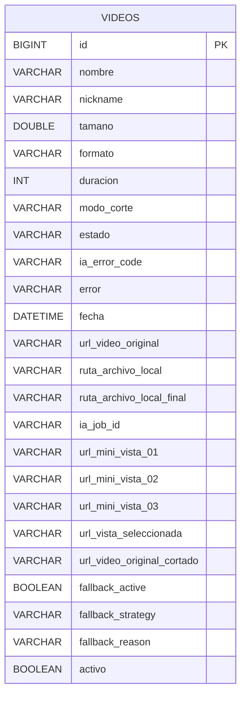

# Modelo H2 - VideoPoc

## Entidad principal

## Notas

- Tabla: `videos`
- BD en memoria: `jdbc:h2:mem:scalevisionmvc`
- `estado` usa enum `VideoStatus`.
- `modo_corte` guarda estrategia activa (`face_tracking` o `center_crop`).
- `ia_job_id` es el id que BE usa para consultar `/scan` y `/process-video`.
- `ia_error_code` + `error` guardan errores propagados desde IA.
- `fallback_*` guarda estrategia sugerida cuando no se detectan sujetos.
